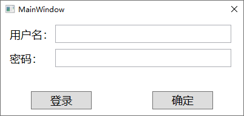
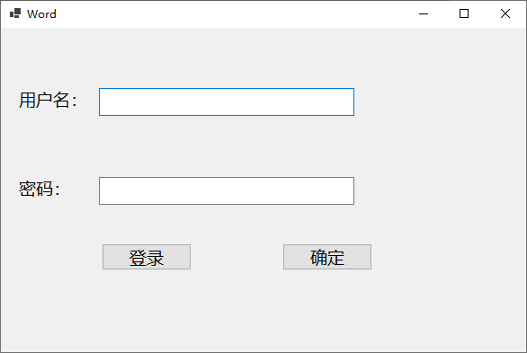
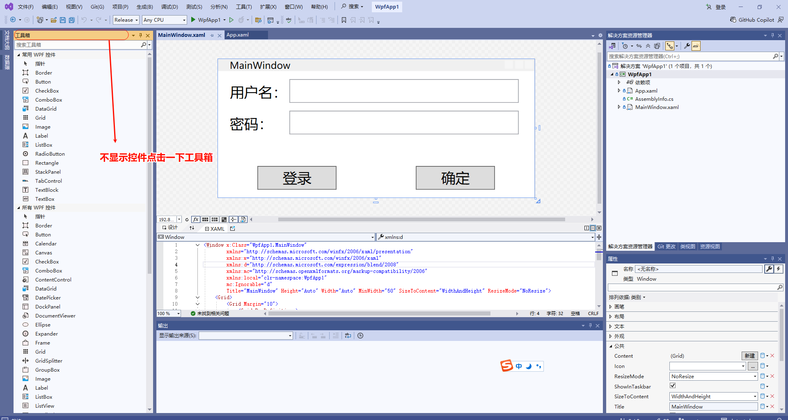
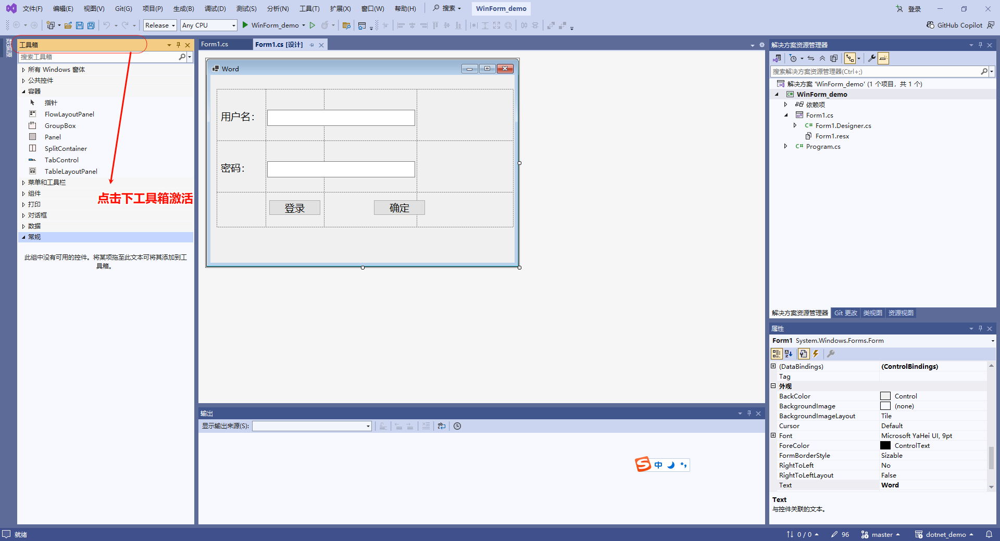
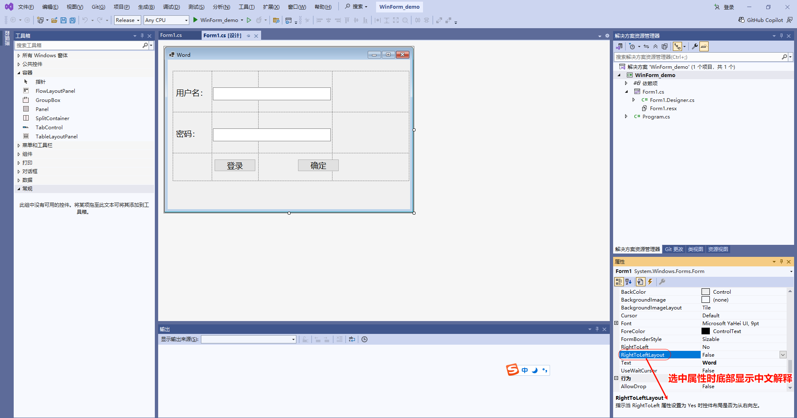

.Net项目迁移后，需要重新创建和WpfApp1.csproj文件项目版本相同的.Net项目生成对应版本的dotnet\shared\Microsoft.NETCore.App共享库文件，然后重新打开迁移后的项目才能正常运行

win10系统上WPF程序效果图：

win10系统上WinForm程序效果图：

vs使用技巧：

点击工具箱激活控件：

点击工具箱激活控件：

选中属性查看底部中文解释：

